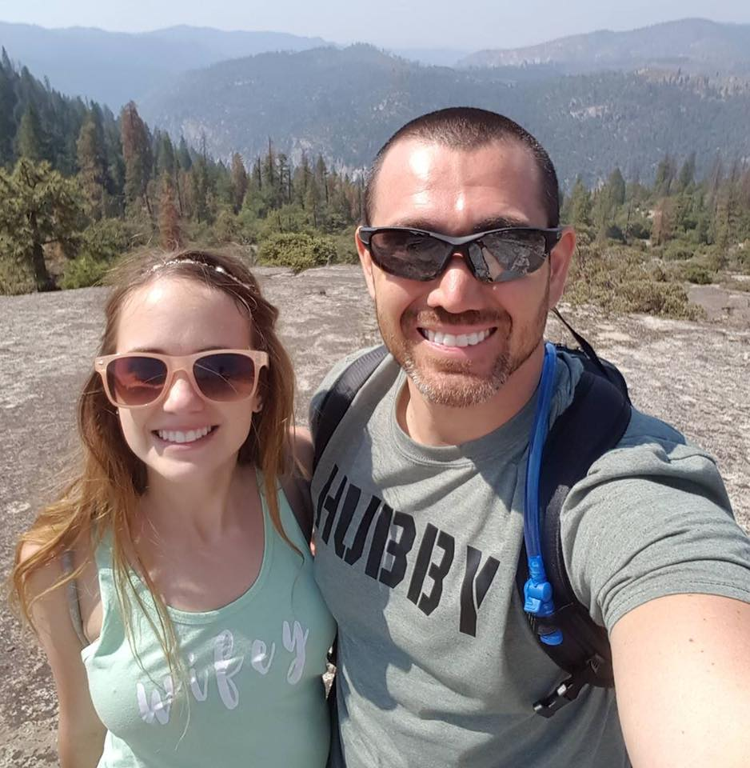

*Currently struggling with getting images to show up. Markdown and HTML syntax works when viewing in GitHub but not on this site.* 

- - -

*external images work fine*

- - -
- - -

- Padded Image:
{: width=250 height=256 style="float:right; padding:16px"}

- - -

- - -

[Info Button Text](#link){: .btn .btn--info}

